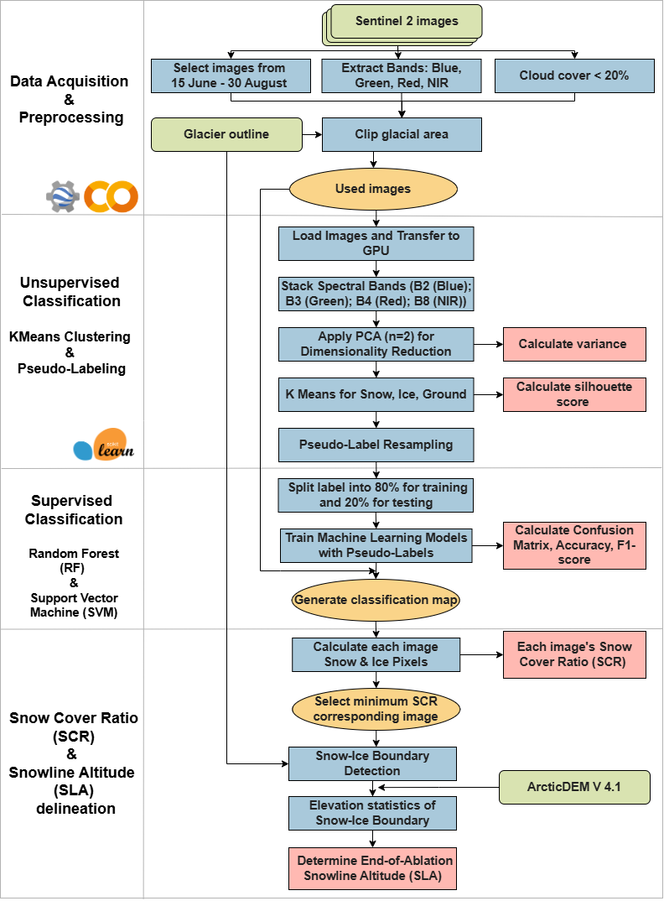
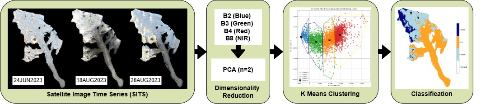

# K-Means-Derived Pseudo-Labels for Glacier Snowline Mapping

This project applies unsupervised machine learning (KMeans clustering with PCA) to generate pseudo-labels for supervised classification (Random Forest, SVM) of snow, ice, and ground from Sentinel-2 imagery. It then calculates the **Snow Cover Ratio (SCR)** and detects **Snowline Altitude (SLA)** using ArcticDEM.

---



---

## 📂 Repository Structure

| File | Purpose |
|------|---------|
| `white_glacier_of_sentinel_2_image_download.ipynb` | 📥 Download and preprocess Sentinel-2 imagery using Google Earth Engine. [](https://colab.research.google.com/github/cwywilson/KMeans-Derived-Pseudo-Labels-for-Machine-Learning-Classification/blob/main/white_glacier_of_sentinel_2_image_download.ipynb)|
| `Training Classifier (PCA + KMeans).ipynb` | 🤖 Perfrom PCA and KMeans for pseudo-label creation and train RF/SVM classifiers. |
| `Snow line Detection.ipynb` | ❄️ Generate classification maps, extract snow-ice boundaries, and calculate SLA from ArcticDEM. |

---

## 🚀 Quickstart Guide

### 1. Clone the Repository
```bash
git clone https://github.com/cwywilson/KMeans-Derived-Pseudo-Labels-for-Machine-Learning-Classification.git
cd KMeans-Derived-Pseudo-Labels-for-Machine-Learning-Classification
```

### 2. Set Up the Environment
Create the Conda environment defined in `environment.yml`:
```bash
conda env create -f environment.yml
conda activate kmeans-glacier
```

### 3. Run the Workflow




#### 📥 Step 1 – Sentinel-2 Image Download [](https://colab.research.google.com/github/cwywilson/KMeans-Derived-Pseudo-Labels-for-Machine-Learning-Classification/blob/main/white_glacier_of_sentinel_2_image_download.ipynb)

Open the notebook `white_glacier_of_sentinel_2_image_download.ipynb`  
- Define your area of interest (AOI) and time range (June 15 – August 30)  
- Export clipped, cloud-free Sentinel-2 imagery over the glacier

#### 🤖 Step 2 – Pseudo-Labeling & Classifier Training
Open `Training Classifier (PCA + KMeans).ipynb`  
- Stack Sentinel-2 bands (B2, B3, B4, B8)  
- Apply PCA (n=2) for dimensionality reduction  
- Run KMeans to classify snow, ice, and ground  
- Resample pseudo-labels and train Random Forest or SVM  
- Output: classified glacier surface

#### ❄️ Step 3 – Snowline Extraction & SLA Calculation
Open `Snow line Detection.ipynb`  
- Compute snow cover for each image  
- Identify image with minimum SCR  
- Use ArcticDEM to determine elevation of the snow-ice boundary  
- Output: Snowline Altitude (SLA)

---


## Features

* Automated Sentinel-2 imagery filtering and downloading via Google Earth Engine (GEE)
* PCA-based dimensionality reduction
* K-Means clustering to generate pseudo-training labels
* Random Forest and SVM classifier training
* Snowline extraction based on classified imagery and elevation band


## Author

Wilson Cheung
PhD Candidate in Glaciology
Queen's University, Canada
